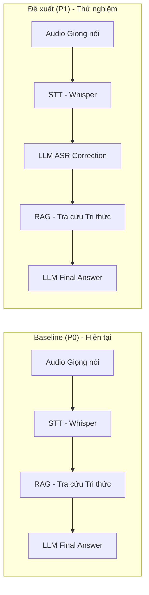

# Báo cáo Benchmark: LLM ASR Correction có cải thiện Pipeline Trợ lý Giọng nói FPT-Assistant-v3 hay không?

**Người thực hiện:** Dinh Van Anh Khoi
**Ngày báo cáo:** 22/07/2026
**Phạm vi:** Recorded-noise robustness benchmark (v2), held-out test set

---

> [!NOTE]
> **📘 Ghi chú dành cho Người đọc Không chuyên Kỹ thuật (Non-Tech Reader Guide):**
> Báo cáo này đã được bổ sung các hộp giải thích thuật ngữ (`> [!TIP]`) ở dưới mỗi phần và **Mục 9: Danh mục Thuật ngữ & Chỉ số Benchmark** ở cuối báo cáo. Bạn có thể dễ dàng tra cứu khái niệm, ý nghĩa các chỉ số (như WER, SNR, Bootstrap...) và cách đọc số liệu (cao/thấp có ý nghĩa gì) mà không làm ảnh hưởng đến tính nguyên bản của dữ liệu kỹ thuật.


## 1. Câu hỏi nghiên cứu và vì sao nó quan trọng

Pipeline trợ lý giọng nói hiện tại xử lý câu hỏi qua ba bước: **STT → RAG → LLM**.
Câu hỏi đặt ra là liệu chèn thêm một bước **LLM sửa lỗi transcript ASR** ngay sau
STT và trước RAG có mang lại câu trả lời tốt hơn hay không — tức so sánh:

- **Baseline (P0):** Audio → STT → raw transcript → RAG → LLM final answer
- **Đề xuất (P1):** Audio → STT → **LLM ASR Correction** → corrected transcript → RAG → LLM final answer

Đây không phải câu hỏi lý thuyết: mỗi lần gọi correction tốn thêm tiền, thêm
latency, và có rủi ro "sửa sai" một câu vốn đã đúng (over-correction). Vì vậy
benchmark cần trả lời rất cụ thể: **có bằng chứng thống kê rằng thêm bước này
giúp giảm lỗi nhận dạng và cải thiện chất lượng trả lời hay không**, chứ không
chỉ dựa vào cảm giác "sửa nghe có vẻ hợp lý hơn".

Để trả lời công bằng, benchmark giữ nguyên tất cả các thành phần khác giữa hai
nhánh (cùng audio, cùng STT, cùng RAG corpus, cùng model trả lời cuối) — chỉ có
bước correction là khác biệt. Đây là nguyên tắc **so sánh có kiểm soát
(paired comparison)**, tránh lặp lại một lỗi thiết kế đã từng gặp trước đó là
chỉ thêm một bước xử lý (`rewrite_query()`) vào một nhánh duy nhất, khiến kết
quả không còn phản ánh đúng tác động của riêng bước correction.

Ngoài P0/P1, benchmark còn đánh giá thêm **P2 — selective correction**: chỉ gọi
LLM sửa lỗi khi một bộ phát hiện rủi ro (`heuristic_v1`, threshold 0.6) cho rằng
transcript có khả năng sai. Ý tưởng của P2 là một phương án triển khai tiết
kiệm chi phí hơn so với "luôn luôn sửa" (P1).

> [!TIP]
> **💡 Giải thích nhanh cho Phần 1 (Khái niệm & Kiến trúc Pipeline):**
> - **STT (Speech-to-Text / ASR):** Công nghệ nhận dạng và chuyển từ giọng nói trong file ghi âm thành văn bản chữ viết.
> - **RAG (Retrieval-Augmented Generation):** Kỹ thuật tra cứu tài liệu/tri thức nội bộ để trả lời câu hỏi chính xác, tránh việc AI "nói bịa".
> - **LLM (Large Language Model):** Mô hình ngôn ngữ lớn (như ChatGPT, GPT-4), đóng vai trò trí tuệ nhân tạo hiểu và tạo câu trả lời.
> - **LLM ASR Correction:** Bước chèn thêm một AI để đọc lại đoạn văn bản vừa đổi từ giọng nói (STT) nhằm phát hiện và sửa từ viết sai trước khi tra cứu RAG.
> - **Baseline (P0):** Phương án tiêu chuẩn hiện tại (Audio → STT → RAG → LLM, không dùng bước sửa lỗi LLM).
> - **Đề xuất (P1):** Phương án luôn luôn gọi LLM để sửa lỗi transcript (Audio → STT → LLM Correction → RAG → LLM).
> - **Selective correction (P2):** Phương án sửa lỗi "thông minh" — chỉ gọi LLM sửa khi bộ lọc rủi ro đánh giá câu thoại có khả năng bị sai.
> - **Latency (Độ trễ):** Thời gian hệ thống phản hồi cho người dùng (thêm bước xử lý = phản hồi chậm hơn).
> - **Over-correction:** Hiện tượng "sửa lợn lành thành lợn què" — câu gốc STT nhận dạng đúng 100%, nhưng AI sửa lỗi lại tự ý sửa thành sai.

---

## 2. Dữ liệu và thiết kế thực nghiệm

### 2.1 Nguồn dữ liệu

- **130 câu hỏi gốc (base utterances)** kèm audio sạch và transcript tham
  chiếu tiếng Việt, lấy từ bộ `AUDIO_299.xlsx` / `Audio_wav`, chỉ dùng các ID
  đã được xác minh khớp đúng (101–230).
- **2 người nói.**
- **40 bản ghi âm nhiễu thật** do chủ dự án tự thu (không dùng noise tổng
  hợp): 4 loại — `fan`, `cafe`, `office`, `speech_babble` — mỗi loại 3 file
  dùng cho dev và 7 file dùng cho test, tách biệt hoàn toàn theo recording ID
  và SHA-256 để tránh rò rỉ dữ liệu (leakage).

### 2.2 Bốn điều kiện âm thanh (C0–C3)

| Điều kiện | Nội dung | Target SNR | Ý nghĩa |
|---|---|---:|---|
| C0 | Audio sạch nguyên bản | — | Baseline không nhiễu |
| C1 | Nhiễu quạt (fan) | 10–15 dB | Nhiễu nhẹ |
| C2 | Nhiễu quán cà phê / văn phòng | 5–10 dB | Nhiễu trung bình |
| C3 | Nhiễu nhiều người nói (speech babble) | 0–5 dB | Nhiễu khó nhất |

SNR càng thấp, nhiễu càng mạnh so với giọng nói. Từ 130 câu gốc, full run tạo
ra **650 audio variants** (130×C0 + 130×C1 + 260×C2 + 130×C3), mỗi variant chạy
qua cả 3 pipeline P0/P1/P2 → **1.950 pipeline rows**.

### 2.3 Phạm vi bằng chứng chính (tránh trộn lẫn dữ liệu)

Để tránh việc "vừa tune vừa test" trên cùng dữ liệu, và tránh trộn audio sạch
với audio nhiễu vào một kết luận, **bằng chứng chính chỉ lấy phần held-out
test có nhiễu thật**:

```
split = test
noise_mode = external_asset
condition ∈ {C1, C2, C3}
```

Sau khi lọc, còn lại:

- **104 câu hỏi test** (base utterances)
- **416 audio variants nhiễu** (104 fan + 104 cafe + 104 office + 104 speech babble)
- **28 bản ghi nhiễu test độc lập, chưa từng thấy khi phát triển**
- **1.248 pipeline rows chính** (416 × 3 pipeline)

Audio sạch (C0), tập dev, và một benchmark synthetic-noise cũ **không** được
gộp vào con số kết luận chính — chúng chỉ là bằng chứng phụ/lịch sử.

### 2.4 Kiểm soát chất lượng dữ liệu (leakage & audit)

- Không trùng `base_id` giữa dev/test; không trùng transcript (exact, chuẩn
  hóa, hoặc gần giống ngữ nghĩa) giữa hai split.
- Không dùng chung file nhiễu hoặc bản ghi nhiễu đã chuẩn hóa giữa dev/test.
- Audit leakage trên toàn bộ 650 dòng manifest: `leakage_detected = false`.
- **Strict local inference audit** xác nhận toàn bộ 650/650 variant và
  1.950/1.950 pipeline row được xử lý thành công, **0 lỗi/loại trừ**, mọi
  stage khớp đúng config hash đã khóa, và audit **không phát sinh thêm lệnh
  gọi API nào** (`api_calls_performed_by_audit: 0`).

> [!TIP]
> **💡 Giải thích nhanh cho Phần 2 (Dữ liệu & Thuật ngữ Đánh giá):**
> - **SNR (Signal-to-Noise Ratio - Tỷ số Tín hiệu trên Nhiễu):** Đơn vị (dB) đo độ rõ của tiếng nói so với tiếng ồn xung quanh.
>   - **SNR cao (10-15 dB):** Tiếng nói to, ồn nhỏ → Giúp máy dễ nhận dạng đúng.
>   - **SNR thấp (0-5 dB):** Tiếng ồn rất to lấn át giọng nói → Máy rất dễ nghe nhầm.
> - **Speech Babble:** Tiếng ồn nhiều người cùng nói xôn xao ở nền (như quán cafe đông người, hội trường), là loại nhiễu khó xử lý nhất đối với AI giọng nói.
> - **Audio Variants:** Các bản thu thử nghiệm được tạo ra bằng cách ghép các loại tiếng ồn ở các mức SNR khác nhau vào giọng nói gốc.
> - **Held-out Test Set:** Bộ dữ liệu kiểm thử giấu kín độc lập, chưa từng dùng để phát triển hay tinh chỉnh hệ thống, đảm bảo kết quả đánh giá thực tế và khách quan.
> - **Data Leakage (Rò rỉ dữ liệu):** Lỗi vô tình để lộ dữ liệu kiểm thử vào tập phát triển khiến kết quả đánh giá bị ảo (tốt hơn thực tế).
> - **Strict Audit:** Quá trình kiểm tra độc lập tự động chạy lại toàn bộ quy trình để đảm bảo 100% dữ liệu trung thực, đúng cấu hình đã khóa và không có lỗi ngầm.

---

## 3. Cách đo lường "tốt hơn"

Benchmark không chỉ nhìn vào một con số WER thấp hơn. Các lớp bằng chứng gồm:

1. **Transcript quality:** Corpus WER (Word Error Rate), CER, số câu
   improved/unchanged/degraded so với raw, và **over-correction rate** — tỷ lệ
   các câu vốn đã đúng 100% bị correction làm sai thêm.
2. **Thống kê có kiểm soát cặp (paired statistics):** so sánh P1−P0 và P2−P0
   trên cùng `variant_id`, dùng **base-cluster bootstrap 95% CI** (5.000 lần
   lặp), **two-way bootstrap** theo cả `base_id × noise_source_recording_id`
   (kiểm soát luôn ảnh hưởng của từng bản ghi nhiễu cụ thể), **Wilcoxon
   signed-rank test**, và **Holm correction** cho nhiều phép so sánh.
3. **Retrieval & answer quality:** proxy overlap giữa query gốc/đã sửa với tài
   liệu tham chiếu (chưa có gold relevance thật), và điểm LLM judge (chỉ là
   bằng chứng phụ trợ, chưa có chấm điểm của con người).
4. **Vận hành:** correction call rate, chi phí API, latency, và các **gate
   sản xuất đã khóa trước** (không đổi sau khi thấy kết quả) — ví dụ
   over-correction tối đa 2%, cần tối thiểu 3 người nói, bắt buộc có
   human task-success evaluation trước khi bật production.

> [!TIP]
> **💡 Giải thích nhanh cho Phần 3 (Thước đo & Thống kê):**
> - **Corpus WER (Word Error Rate - Tỷ lệ lỗi từ):** Tỷ lệ phần trăm từ bị máy nghe sai/thiếu/thừa trên toàn bộ bộ dữ liệu.
>   - **WER càng THẤP càng TỐT:** Ví dụ WER = 0% là chính xác 100%; WER = 5% là chỉ sai 5 từ trên 100 từ.
>   - **WER càng CAO càng XẤU:** WER > 20% tức là nghe sai nhiều từ, gây hiểu nhầm hoặc mất nghĩa câu.
> - **Corpus CER (Character Error Rate - Tỷ lệ lỗi ký tự):** Tương tự WER nhưng đo sai sót ở cấp độ từng chữ cái (ký tự).
> - **Paired Statistics & Bootstrap 95% CI:** Phương pháp toán thống kê chạy mô phỏng 5.000 lần để kiểm tra xem chênh lệch giữa P1 và P0 là bản chất thật hay ngẫu nhiên.
>   - **Khoảng tin cậy chứa số 0 (ví dụ [-0.71%, +0.71%]):** Cho thấy **KHÔNG có sự khác biệt có ý nghĩa thống kê** giữa 2 phương án (ngang ngửa nhau).
> - **Wilcoxon test & Holm-adjusted p-value:** Chỉ số đo xác suất kết quả xảy ra do ngẫu nhiên. `p-value` gần 1.0 khẳng định chắc chắn bước sửa lỗi **không mang lại cải thiện nào**.

---

## 4. Kết quả chính

### 4.1 Transcript — WER/CER trên 416 variants test có nhiễu

| Pipeline | Corpus WER | Corpus CER | Improved | Unchanged | Degraded |
|---|---:|---:|---:|---:|---:|
| P0 (raw) | 16,59% | 11,67% | 0 | 416 | 0 |
| P1 (always-correct) | 16,62% | 11,94% | 11 | 391 | 14 |
| P2 (selective) | 16,59% | 11,67% | 0 | 416 | 0 |

**P1 so với P0:**

- Chênh lệch WER trung bình: **+0,000039** (P1 hơi cao hơn, tức nhỉnh xấu hơn về điểm số tuyệt đối).
- Base-cluster bootstrap 95% CI: **[-0,004611 ; +0,004865]**
- Two-way bootstrap 95% CI (theo cả nguồn nhiễu): **[-0,007079 ; +0,007075]**
- Wilcoxon p-value: **0,9553**; Holm-adjusted p-value: **1,0**

→ Cả hai khoảng tin cậy đều **chứa 0 rất rõ ràng**, p-value gần bằng 1. Đây là
bằng chứng thống kê mạnh rằng **không có khác biệt đáng kể** giữa P1 và P0 —
tức chưa thể nói correction giúp giảm WER.

**Over-correction:** Trong 151 câu mà P0 vốn đã đúng tuyệt đối (0 lỗi), P1 làm
sai thêm **4 câu → tỷ lệ 4/151 = 2,649%**, **vượt ngưỡng gate sản xuất đã khóa
(tối đa 2%)**. Đây là 4/14 câu bị "degraded" — tức correction không chỉ không
giúp thêm mà còn phá hỏng một số câu vốn không có vấn đề gì.

**P2 (selective):** bộ phát hiện rủi ro `heuristic_v1` trả về `use_raw` cho
**650/650 variants (100%)** trong toàn bộ run — nghĩa là **correction call rate
của P2 = 0%**, và do đó P2 = P0 tuyệt đối. Đây là hạn chế của detector hiện
tại (ngưỡng 0.6 chưa từng được kích hoạt), không phải bằng chứng rằng ý tưởng
selective correction nói chung là vô dụng.

### 4.2 Theo từng loại nhiễu

| Loại nhiễu | P0 WER | P1 WER | Improved/Unchanged/Degraded | Nhận xét |
|---|---:|---:|---:|---|
| Fan | 11,69% | 12,05% | 2 / 98 / 4 | P1 xấu hơn |
| Cafe | 14,92% | 15,04% | 2 / 99 / 3 | P1 xấu hơn nhẹ |
| Office | 14,44% | 15,04% | 1 / 99 / 4 | P1 xấu hơn |
| Speech babble | 25,30% | 24,34% | 6 / 95 / 3 | **Duy nhất có tín hiệu tích cực** |

`speech_babble` (điều kiện khó nhất, SNR 0–5dB) là loại nhiễu duy nhất mà P1
cải thiện WER cục bộ.

### 4.3 Retrieval và chất lượng câu trả lời

| Pipeline | Proxy Jaccard@5 | Proxy overlap recall@5 | Judge correctness |
|---|---:|---:|---:|
| P0 | 55,18% | 59,19% | 4,204 |
| P1 | 57,18% | 61,08% | 4,192 |
| P2 | 55,18% | 59,19% | 4,188 |

P1 có nhỉnh hơn một chút ở proxy retrieval, nhưng khoảng tin cậy vẫn chứa 0
(Holm-adjusted p = 0,541).
Điểm judge của P1 **không cao hơn** P0.

### 4.4 Chi phí và mức độ tin cậy của run

- Toàn bộ 650 variants / 1.950 rows đã chạy xong, **0 lỗi/loại trừ**.
- STT: 45,762 phút audio tính phí.
- Tổng chi phí API cho toàn bộ thực nghiệm: **1,696573 USD**.
- Strict audit: `verified = true`, mọi stage khớp config hash, không có API
  call phát sinh ngoài kế hoạch.

> [!TIP]
> **💡 Giải thích nhanh cho Phần 4 (Ý nghĩa của Kết quả Thực nghiệm):**
> - **P1 WER = 16,62% vs P0 WER = 16,59%:** Phương án P1 (luôn sửa lỗi) có WER cao hơn P0 0.03%, nghĩa là ép AI sửa mọi câu khiến tổng số lỗi từ lại **tăng nhẹ**, kém hơn một chút so với dùng nguyên transcript gốc!
> - **Tỷ lệ Over-correction = 2,65% (4/151 câu):** Trong 151 câu mà STT đã nghe đúng tuyệt đối, AI sửa lỗi lại nhảy vào làm sai 4 câu. Tỷ lệ này vượt ngưỡng an toàn cho phép (tối đa 2%), làm vi phạm tiêu chuẩn sản xuất (Production Gate).
> - **Proxy Jaccard / Recall@5:** Điểm đo khả năng tra cứu tài liệu của RAG. P1 nhỉnh hơn một chút ở chỉ số này nhưng mới chỉ là chỉ số giả định (Proxy), chưa được kiểm chứng bởi con người.
> - **LLM Judge:** Điểm AI tự chấm điểm AI (khoảng 4.2/5). Điểm này chỉ dùng tham khảo, không thay thế được đánh giá thực tế từ con người (Human grading).

---

## 5. Kết luận (logic suy luận từng bước)

1. **Thiết kế so sánh công bằng** (cùng audio/STT/RAG/model, chỉ khác bước
   correction) → khác biệt quan sát được là do chính bước correction gây ra,
   không bị nhiễu bởi yếu tố khác.
2. **Trên 416 variants held-out test có nhiễu thật**, corpus WER của P1
   (16,62%) **cao hơn nhẹ** P0 (16,59%), không thấp hơn.
3. **Cả hai loại khoảng tin cậy bootstrap (base-cluster và two-way theo nguồn
   nhiễu) đều chứa 0**, và Wilcoxon/Holm-adjusted p-value đều rất cao (0,955
   và 1,0) → **không có bằng chứng thống kê** rằng P1 tốt hơn P0.
4. P1 sửa đúng thêm 11 câu nhưng **làm sai thêm 14 câu**, trong đó 4 câu là
   over-correction trên các câu vốn đã hoàn toàn đúng — **vượt ngưỡng an toàn
   sản xuất đã khóa trước (2%)**.
5. P2 (phương án tiết kiệm chi phí hơn) **không hề gọi correction** trong toàn
   bộ 650 variants → hoàn toàn tương đương P0, không mang lại giá trị tăng
   thêm với implementation risk-detector hiện tại.
6. Tín hiệu tích cực duy nhất (`speech_babble`) không đủ mạnh về mặt thống kê
   toàn cục để khái quát hóa.

> **Kết luận có thể phát biểu với team/hội đồng:**
> Trên 416 audio variants nhiễu thật, held-out, từ 104 câu hỏi và 28 bản ghi
> nhiễu test độc lập, việc thêm bước LLM ASR correction (P1) trước RAG **chưa
> chứng minh được cải thiện tổng thể** so với dùng transcript STT nguyên bản
> (P0). WER tăng nhẹ (16,59% → 16,62%), khoảng tin cậy đều chứa 0, và tỷ lệ
> over-correction (2,65%) vượt ngưỡng an toàn đã khóa. P2 selective correction,
> với bộ phát hiện rủi ro hiện tại, không hề được kích hoạt nên tương đương
> hoàn toàn với baseline. **Không có căn cứ để bật correction trong
> production ở giai đoạn này.**

**Lưu ý quan trọng khi trình bày:** Đây **không** phải kết luận rằng "LLM
correction luôn vô ích". Kết quả chỉ bác bỏ tuyên bố rằng **implementation
hiện tại** (model, prompt, và risk detector hiện tại) tốt hơn baseline một
cách tổng quát trên bộ dữ liệu benchmark này.


---

## 6. Phụ lục — nguồn dẫn chứng (audit trail)

| Nội dung | Đường dẫn |
|---|---|
| Báo cáo tổng hợp tiếng Việt gốc | `reports_recorded_noise/TEAM_BENCHMARK_REPORT_VI.md` |
| Phương pháp luận (thống kê, đơn vị đo, quyết định) | `METHODOLOGY.md` |
| Giới hạn và mô tả dữ liệu | `DATA_CARD.md` |
| P2, over-correction, two-way bootstrap, breakdown theo nhiễu | `INTERPRETATION_LOCK_SUPPLEMENT.md` |
| Strict audit (provenance, chi phí, xác minh không lỗi) | `local_inference_audit.json` |
| Hướng dẫn tái chạy / bàn giao end-to-end | `END_TO_END_BENCHMARK_HANDOFF.md` |
| Bảng metrics chi tiết | `robustness_v2_recorded_noise_metrics.csv` |
| Dữ liệu từng mẫu | `robustness_v2_recorded_noise_sample_level.csv` |
| Dữ liệu thống kê theo `base_id` | `robustness_v2_recorded_noise_base_level.csv` |

**Tóm tắt một dòng cho slide:** P0 = 16,59% WER; P1 = 16,62% WER (11 improved,
14 degraded); two-way 95% CI [-0,71%, +0,71%]; Holm-adjusted p = 1,0 →
**chưa đủ bằng chứng bật correction trong production**; tín hiệu
`speech_babble` là giả thuyết cho vòng nghiên cứu kế tiếp.

---

## 9. Phụ lục bổ sung: Danh mục Thuật ngữ & Bảng tra cứu Chỉ số Benchmark (Dành cho Non-Tech)

Để hỗ trợ ban quản lý và người đọc không chuyên về AI/NLP dễ dàng nắm bắt báo cáo, dưới đây là bảng tổng hợp tra cứu toàn bộ các thuật ngữ kỹ thuật và ý nghĩa chi tiết của từng chỉ số đo lường xuất hiện trong báo cáo:

### 9.1 Bảng Ý nghĩa các Chỉ số Đo lường (Metrics Breakdown)

| Chỉ số / Metric | Tên đầy đủ & Khái niệm dễ hiểu | Khi CAO nói lên điều gì? | Khi THẤP nói lên điều gì? | Ý nghĩa trong báo cáo này |
|---|---|---|---|---|
| **Corpus WER** | **Word Error Rate (Tỷ lệ lỗi từ):** Phần trăm số từ bị sai, thiếu hoặc thừa so với văn bản gốc chuẩn. | ❌ **XẤU:** Nhận dạng sai nhiều từ, câu văn bị méo mó, khó hiểu. | 🟢 **TỐT:** Nhận dạng chính xác, nghe đúng hầu hết các từ (0% = hoàn hảo). | P0 đạt 16,59%, P1 là 16,62%. P1 cao hơn nghĩa là bước sửa lỗi làm **tăng lỗi từ**, không hiệu quả. |
| **Corpus CER** | **Character Error Rate (Tỷ lệ lỗi ký tự):** Phần trăm ký tự (chữ cái) bị sai sót. | ❌ **XẤU:** Sai nhiều chữ cái, sai chính tả nặng. | 🟢 **TỐT:** Đúng từng chữ cái, chính tả chuẩn xác. | P0 đạt 11,67%, P1 là 11,94%. P1 cao hơn khẳng định thêm việc sửa lỗi gây sai chính tả nhiều hơn. |
| **SNR (dB)** | **Signal-to-Noise Ratio (Tỷ số tín hiệu / nhiễu):** Mức độ to của giọng nói so với tiếng ồn nền. | 🟢 **TỐT (10-15 dB):** Giọng nói rõ ràng, tiếng ồn nhỏ, máy dễ nghe. | ❌ **KHÓ (0-5 dB):** Tiếng ồn rất to lấn át giọng nói, máy rất dễ nghe lầm. | Điều kiện C3 (Speech babble) có SNR 0-5dB là thử thách khó nhất cho pipeline trợ lý giọng nói. |
| **Over-correction Rate** | **Tỷ lệ sửa nhầm:** Phần trăm câu vốn đã đúng 100% nhưng bị AI sửa lỗi làm thành sai. | ❌ **RẤT XẤU:** AI "sửa lợn lành thành lợn què", phá hỏng câu đúng của người dùng. | 🟢 **TỐT:** AI thông minh, chỉ sửa câu sai, giữ nguyên câu đúng (mục tiêu ≤ 2%). | P1 bị 2,65% (4/151 câu), vượt ngưỡng an toàn cho phép (2%), nguy cơ gây hại cho trải nghiệm người dùng. |
| **Bootstrap 95% CI** | **Khoảng tin cậy 95% (Confidence Interval):** Khoảng giá trị chênh lệch thực sự với độ tin cậy 95%. | **Nếu khoảng chứa số 0 (ví dụ [-0,71%, +0,71%]):** Sự chênh lệch giữa 2 phương án là **không có ý nghĩa thống kê** (ngang nhau). | **Nếu khoảng không chứa 0:** Sự chênh lệch là chắc chắn có thật, không phải do ngẫu nhiên. | Kết quả P1-P0 đều chứa 0 → khẳng định bước sửa lỗi **chưa chứng minh được hiệu quả**. |
| **Wilcoxon p-value** | **Mức độ ý nghĩa thống kê:** Xác suất để kết quả quan sát được chỉ là do may rủi ngẫu nhiên. | ❌ **p > 0.05 (gần 1.0):** Không có sự khác biệt thực sự, chênh lệch chỉ là ngẫu nhiên. | 🟢 **p < 0.05:** Sự cải thiện/khác biệt là có thật và đáng tin cậy. | p-value của P1 vs P0 = 1,0 (sau điều chỉnh Holm) → Bác bỏ hoàn toàn giả thuyết LLM correction giúp cải thiện. |
| **Proxy Retrieval Overlap** | **Độ trùng khớp tra cứu tài liệu (Jaccard / Recall@5):** Điểm đo mức độ khớp giữa câu hỏi và tài liệu tra cứu. | 🟢 **TỐT:** Tìm được tài liệu có từ ngữ tương đồng cao với câu hỏi. | ❌ **XẤU:** Tài liệu tìm được ít liên quan đến từ ngữ câu hỏi. | P1 nhỉnh hơn P0 (57,18% vs 55,18%), nhưng chỉ là chỉ số tạm thời (Proxy), chưa có kiểm chứng bởi con người. |
| **LLM Judge Score** | **Điểm AI tự chấm điểm:** Thang điểm (1-5) do một AI khác chấm chất lượng câu trả lời cuối. | 🟢 **TỐT:** AI đánh giá câu trả lời logic, đúng trọng tâm. | ❌ **XẤU:** AI đánh giá câu trả lời sai lệch hoặc thiếu thông tin. | P1 (4,192) ngang P0 (4,204), cho thấy chất lượng câu trả lời cuối cùng **không được cải thiện**. |

---

### 9.2 Bảng Thuật ngữ Kiến trúc & Công nghệ AI (Glossary)



- **Pipeline (Chuỗi xử lý):** Tập hợp các bước phần mềm nối tiếp nhau để xử lý yêu cầu từ lúc nhận giọng nói người dùng đến khi phát ra câu trả lời.
- **STT (Speech-to-Text):** Bộ chuyển đổi giọng nói thành văn bản.
- **ASR (Automatic Speech Recognition):** Tên gọi chuyên ngành quốc tế của STT (Nhận dạng giọng nói tự động).
- **RAG (Retrieval-Augmented Generation):** Bộ tra cứu tài liệu thông minh. Giúp AI trả lời dựa trên đúng dữ liệu nội bộ dự án thay vì đoán mò.
- **LLM (Large Language Model):** Mô hình ngôn ngữ lớn làm bộ não xử lý ngôn ngữ tự nhiên.
- **Baseline (P0):** Mô hình đối chứng ban đầu (chuẩn so sánh).
- **Heuristic Detector:** Thuật toán lọc rủi ro nhanh dựa trên các quy tắc toán học/kinh nghiệm có sẵn, giúp P2 quyết định khi nào nên sửa lỗi để tiết kiệm chi phí API.
- **Production Gate:** Các tiêu chí kiểm định nghiêm ngặt bắt buộc phải vượt qua trước khi phát hành phiên bản mới cho người dùng thật.
- **Human Task-Success:** Đánh giá của con người về việc hệ thống có thực sự giải quyết được nhu cầu của người dùng hay không (đây là tiêu chí quan trọng nhất).

