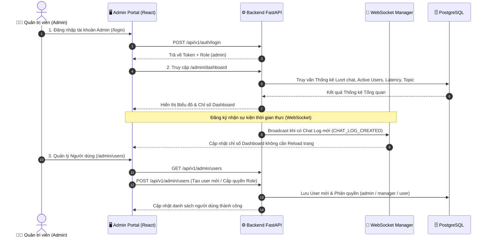

# 🛡️ KỊCH BẢN DEMO LUỒNG 3: ADMIN (QUẢN TRỊ HỆ THỐNG & GIÁM SÁT)

> **Mục tiêu**: Demo khả năng quản trị hệ thống toàn diện của Admin: Giám sát chỉ số vận hành thời gian thực (Real-time Analytics), Quản lý người dùng & Phân quyền (RBAC), và Cấu hình tham số hệ thống.

---

## 📐 Sơ đồ Tiến trình (Mermaid Flowchart)

---

## 🎬 Kịch bản Chi tiết & Lời thoại Trình diễn

### **Giai đoạn 1: Giám sát Hệ thống thời gian thực (Real-time Dashboard) (2 phút)**
- **Thao tác**:
  1. Đăng nhập tài khoản Admin: `admin@fpt.edu.vn`.
  2. Màn hình tự động chuyển đến trang **Admin Dashboard** ([AdminDashboard.tsx](file:///e:/merged_partition_content/Khoi_Project/FPT-Assistant-v3/frontend/src/pages/admin/AdminDashboard.tsx)).
  3. Show các thẻ chỉ số quan trọng (KPI Cards):
     - **Total Chat Requests**: Tổng số câu hỏi đã phục vụ.
     - **Average Latency**: Thời gian phản hồi trung bình của hệ thống (ms).
     - **Active Users**: Số giám thị đang hoạt động.
     - **Topic Distribution Chart**: Biểu đồ phân bổ chủ đề câu hỏi (Quy chế thi, Sự cố EOS, Mạng Wi-Fi, v.v.).
  4. Thực hiện demo **WebSocket Real-time**: Mở 1 tab ẩn danh đóng vai Giám thị gửi 1 câu hỏi chat -> Màn hình Admin Dashboard ngay lập tức tăng số lượng Chat Requests mà không cần F5 làm mới trang.
- **Lời thoại demo**:
  > *"Giao diện Admin Dashboard giúp ban quản lý theo dõi toàn bộ hiệu năng hệ thống theo thời gian thực nhờ kết nối WebSocket. Các chỉ số về độ trễ, số lượng truy vấn và nhóm chủ đề được cập nhật liên tục để kịp thời phát hiện các điểm nóng sự cố trong kỳ thi."*

---

### **Giai đoạn 2: Quản lý Người dùng & Phân quyền RBAC (2 phút)**
- **Thao tác**:
  1. Điều hướng sang mục **Quản lý người dùng** ([UsersManagement.tsx](file:///e:/merged_partition_content/Khoi_Project/FPT-Assistant-v3/frontend/src/pages/admin/UsersManagement.tsx)).
  2. Thực hiện thao tác:
     - Thêm một tài khoản Giám thị mới: `giamsath01@fpt.edu.vn`.
     - Phân quyền người dùng theo Role (`admin`, `manager`, `user`).
     - Đổi trạng thái kích hoạt / Khóa tài khoản khi cần bảo mật.
     - Reset mật khẩu cho người dùng.
- **Lời thoại demo**:
  > *"Hệ thống tích hợp cơ chế phân quyền RBAC chặt chẽ. Admin có thể linh hoạt cấp quyền cho Cán bộ quản lý hoặc Giám thị, đồng thời quản lý vòng đời tài khoản an toàn tuyệt đối."*

---

### **Giai đoạn 3: Cấu hình Hệ thống & Email Settings (1 phút)**
- **Thao tác**:
  1. Mở mục **Cấu hình hệ thống** ([AdminSettings.tsx](file:///e:/merged_partition_content/Khoi_Project/FPT-Assistant-v3/frontend/src/pages/admin/AdminSettings.tsx)).
  2. Xem & chỉnh sửa thông số SMTP Email (gửi mail khôi phục mật khẩu, thông báo hệ thống).
- **Lời thoại demo**:
  > *"Mục Cấu hình cho phép thiết lập các tham số hệ thống như cấu hình SMTP Server, thời gian hết hạn Token JWT mà không cần can thiệp trực tiếp vào mã nguồn."*
