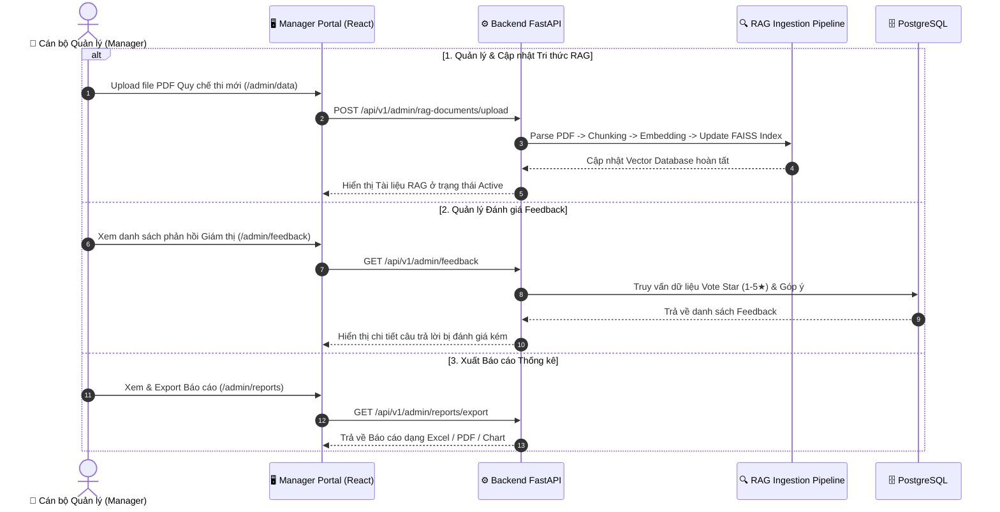

# 📊 KỊCH BẢN DEMO LUỒNG 4: MANAGEMENT (QUẢN LÝ TRI THỨC RAG & BÁO CÁO)

> **Mục tiêu**: Demo trải nghiệm của Cán bộ Quản lý tri thức (Manager/Trưởng điểm thi): Upload và Cập nhật tài liệu quy chế PDF (Document Ingestion), Giám sát đánh giá chất lượng câu trả lời (Feedback Loop), và Báo cáo tổng hợp tình hình ca thi.

---

## 📐 Sơ đồ Tiến trình (Mermaid Flowchart)

---

## 🎬 Kịch bản Chi tiết & Lời thoại Trình diễn

### **Giai đoạn 1: Quản lý Tri thức RAG & Upload Tài liệu mới (2 phút)**
- **Thao tác**:
  1. Đăng nhập tài khoản Manager.
  2. Mở mục **Dữ liệu Chatbot (RAG Data)**.
  3. Xem danh sách các file PDF hiện tại trong hệ thống (Quy chế thi 2024, Hướng dẫn phần mềm EOS, Quy trình IT).
  4. Thực hiện **Upload file PDF quy chế sửa đổi mới**:
     - Chọn file PDF quy chế mới.
     - Hệ thống chạy tiến trình tự động: Phân trang -> Cắt chunk -> Tạo Vector Embedding -> Lưu vào FAISS Index.
     - File mới hiển thị trạng thái `Active`.
  5. Thử nghiệm bật/tắt (Toggle Enable/Disable) một tài liệu quy chế cũ.
- **Lời thoại demo**:
  > *"Khi nhà trường thay đổi hoặc bổ sung quy chế thi mới, Cán bộ quản lý chỉ cần upload file PDF lên hệ thống. RAG Pipeline sẽ tự động phân tách và nạp tri thức mới vào Vector Store ngay lập tức mà không cần lập trình lại hệ thống."*

---

### **Giai đoạn 2: Quản lý Phản hồi Giám thị (Feedback Loop) (2 phút)**
- **Thao tác**:
  1. Điều hướng sang mục **Quản lý Phản hồi**.
  2. Xem danh sách phản hồi đánh giá từ Giám thị (Rating 1 - 5 sao và nhận xét chi tiết).
  3. Lọc danh sách các câu trả lời bị đánh giá 1-2 sao.
  4. Xem chi tiết: Câu hỏi gốc của giám thị, Câu trả lời của AI, và Lý do giám thị chưa hài lòng (Ví dụ: *"Cần hướng dẫn chi tiết hơn bước 3"*).
  5. Đánh giá nguyên nhân để cập nhật lại tài liệu hoặc tinh chỉnh System Prompt.
- **Lời thoại demo**:
  > *"Hệ thống tích hợp cơ chế Feedback Loop chủ động. Cán bộ quản lý dễ dàng lọc ra những câu trả lời AI phục vụ chưa tốt để liên tục cải thiện chất lượng dữ liệu tri thức."*

---

### **Giai đoạn 3: Báo cáo Thống kê & Xuất dữ liệu (1 phút)**
- **Thao tác**:
  1. Truy cập trang **Báo cáo Thống kê**.
  2. Thống kê theo khoảng thời gian / ca thi.
  3. Xem danh sách các sự cố kỹ thuật xảy ra nhiều nhất trong đợt thi.
- **Lời thoại demo**:
  > *"Trang Báo cáo hỗ trợ Trưởng điểm thi có cái nhìn toàn cảnh về tần suất sự cố và nhu cầu hỗ trợ trong kỳ thi, phục vụ công tác tổng kết và cải tiến cho các kỳ thi tiếp theo."*
