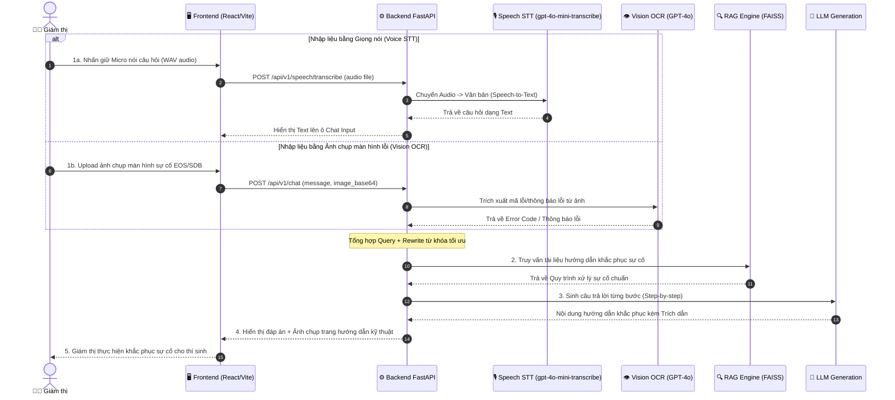

# 🎙️ KỊCH BẢN DEMO LUỒNG 2: USER + MULTIMODAL (VISION OCR & VOICE STT)

> **Mục tiêu**: Demo khả năng nhận diện hình ảnh sự cố phần mềm thi (Vision OCR) và tương tác giọng nói rảnh tay (Speech-to-Text) giúp Giám thị xử lý nhanh các tình huống phát sinh trong phòng thi mà không cần gõ phím.

---

## 📐 Sơ đồ Tiến trình (Mermaid Flowchart)

---

## 🎬 Kịch bản Chi tiết & Lời thoại Trình diễn

### **Giai đoạn 1: Demo Nhận diện Ảnh sự cố Kỹ thuật (Vision OCR) (2 phút)**
- **Bối cảnh**: Màn hình máy tính thí sinh bị treo/lỗi ứng dụng thi EOS với mã lỗi `EOS_ERR_NET_DISCONNECT_503`.
- **Thao tác**:
  1. Giám thị dùng điện thoại/máy tính chụp màn hình lỗi.
  2. Tại giao diện Chat, nhấn nút **Upload Image (Icon Ảnh)**, chọn file ảnh lỗi.
  3. Nhấn Send (không cần gõ thêm chữ nào hoặc chỉ cần gõ *"Lỗi này xử lý thế nào?"*).
  4. Backend gọi Vision OCR trích xuất mã lỗi `EOS_ERR_NET_DISCONNECT_503`.
  5. RAG tìm đúng bài hướng dẫn *"Khắc phục sự cố rớt mạng EOS trong khi làm bài"*.
  6. Kết quả trả về:
     - Các bước xử lý 1-2-3 (Kiểm tra cáp mạng, Re-login EOS bằng OTP Giám thị).
     - Hiển thị ảnh trang tài liệu kỹ thuật IT gốc.
- **Lời thoại demo**:
  > *"Trong lúc coi thi, giám thị không cần phải ngồi gõ lại các mã lỗi kỹ thuật phức tạp. Chỉ cần chụp ảnh màn hình bị lỗi và gửi lên, hệ thống sẽ tự động đọc nội dung và trả về quy trình xử lý từng bước kèm minh họa chính xác."*

---

### **Giai đoạn 2: Demo Tương tác Giọng nói Rảnh tay (Voice STT) (2 phút)**
- **Bối cảnh**: Giám thị đang di chuyển quan sát trong phòng thi, không tiện ngồi bàn gõ phím.
- **Thao tác**:
  1. Giám thị nhấn vào biểu tượng **Microphone** trên giao diện Chat.
  2. Màn hình xuất hiện giao diện sóng âm **Voice Overlay**
  3. Giám thị nói: *"Thí sinh làm nộp bài thi sớm trước 2/3 thời gian có được đi ra ngoài không?"*
  4. Hệ thống ghi âm và gửi đi
  5. Nhận kết quả câu trả lời quy chế thi tức thì.
- **Lời thoại demo**:
  > *"Tính năng tương tác bằng giọng nói giúp giám thị hoàn toàn rảnh tay khi đang đi tuần trong phòng thi. Hệ thống nhận diện giọng nói tiếng Việt chuyên sâu, phản hồi tức thì các câu hỏi quy chế thi."*

---

## 🧪 Danh mục Test Case Multimodal

1. **Test Case OCR 1**: Ảnh chụp thông báo lỗi phần mềm thi SDB: `"Can not connect to Exam Server - Code 102"`.
   - *Kỳ vọng*: RAG trích xuất đúng quy trình Reset kết nối IP Server của bộ phận IT.
2. **Test Case OCR 2**: Ảnh chụp thông báo lỗi đăng nhập Portal: `"Invalid OTP Credentials"`.
   - *Kỳ vọng*: Trả về hướng dẫn cấp lại OTP khẩn cấp cho giám thị.
3. **Test Case Voice 1**: *"Cho hỏi thí sinh bị đau bụng đột xuất giữa giờ thi thì giám thị cần làm gì?"*
   - *Kỳ vọng*: STT dịch chuẩn văn bản -> RAG trả về quy trình đưa thí sinh xuống y tế kèm cán bộ giám sát.
