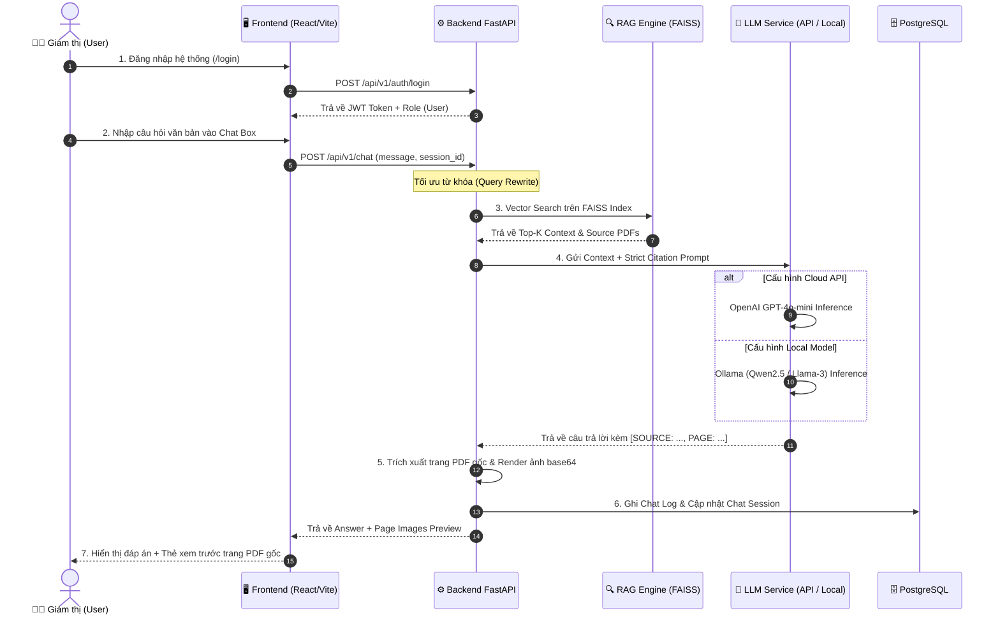

# 📖 KỊCH BẢN DEMO LUỒNG 1: USER + TEXT CHAT & RAG

> **Mục tiêu**: Demo trải nghiệm của Giám thị khi tra cứu quy chế thi bằng câu hỏi văn bản (Text Q&A), quy trình RAG trích dẫn trang PDF gốc chuẩn xác, và phần so sánh cao trào giữa **API Model** vs **Local Model**.

---

## 📐 Sơ đồ Tiến trình (Mermaid Flowchart)

---

## 🎬 Kịch bản Chi tiết & Lời thoại Trình diễn

### **Giai đoạn 1: Khởi động & Tạo phiên làm việc (1 phút)**
- **Thao tác**:
  1. Giám thị mở trình duyệt & truy cập.
  2. Đăng nhập bằng tài khoản Giám thị.
  3. Màn hình điều hướng vào trang Chat chính.
  4. Bấm nút **"Cuộc trò chuyện mới"** trên Sidebar để tạo một `ChatSession` mới.

---

### **Giai đoạn 2: Thực thi Text Chat & RAG Trích dẫn PDF (2 phút)**
- **Thao tác**:
  1. Gõ câu hỏi văn bản vào ô ChatInput:
     > `Nêu các bước xử lý khi sinh viên bị mất kết nối mạng trong lúc làm bài thi EOS?`
  2. Nhấn Send.
  3. Nhận kết quả câu trả lời:
     - Văn bản giải thích các mức xử lý.
     - Đoạn trích dẫn định dạng `[SOURCE: Quy_che_coi_thi_2026.pdf, PAGE: 14]`.
     - Phía dưới câu trả lời xuất hiện **Thumbnail Trang 14 của file PDF gốc**.
  4. Giám thị bấm vào Thumbnail để phóng to trang PDF và đối chiếu quy chế thực tế.
- **Lời thoại demo**:
  > *"Khi giám thị gửi câu hỏi, RAG Engine sẽ tự động trích xuất đúng điều khoản trong file PDF quy chế của nhà trường. Đặc biệt, hệ thống không chỉ trả lời bằng chữ mà còn cắt trực tiếp hình ảnh trang PDF gốc để giám thị đối chiếu ngay tại phòng thi, loại bỏ 100% rủi ro AI bịa đặt thông tin."*

---

### **Giai đoạn 3: [CLIMAX] So sánh Model API vs Model Local (3 phút)**

- **Thao tác**:
  1. Thực hiện lại 2 câu hỏi test case phức tạp trên phiên bản cấu hình **API (GPT-4o-mini)** và **Local (Qwen2.5)**:
     - *Test Case 1*: *"Sinh viên đi trễ 20 phút có được vào phòng thi không?"*
     - *Test Case 2*: *"Quy trình lập biên bản khi thí sinh mang tài liệu vào phòng thi?"*
  2. Chiếu bảng đối chiếu thực tế trên màn hình:

| Tiêu chí So sánh | ☁️ Cloud API (GPT-4o-mini) | 💻 Local LLM (Qwen2.5 / Llama-3) |
| :--- | :--- | :--- |
| **Độ tuân thủ Format Trích dẫn** | 100% tuân thủ `[SOURCE... PAGE...]` | ~90% (Cần Prompting kỹ hơn) |
| **Tốc độ phản hồi (Text Latency)** | **Nhanh (~1.2s - 1.8s)** | Phụ thuộc phần cứng GPU (~2.5s - 4.5s) |
| **Khả năng chạy Offline** | ❌ Cần kết nối Internet | ✅ **Hoạt động 100% Offline** (Bảo mật tuyệt đối) |
| **Chi phí API** | Trả theo Token sử dụng | **0 VNĐ chi phí API** |

- **Lời thoại kết thúc**:
  > *"Như vậy, mô hình Cloud API mang lại tốc độ và độ tuân thủ trích dẫn hoàn hảo cho điều kiện mạng thông thường. Tuy nhiên, tùy chọn Local LLM là bước tiến chiến lược giúp FPT Exam Assistant có thể triển khai hoàn toàn Offline trong các phòng thi cách ly mạng, đảm bảo tính bảo mật và độc lập tuyệt đối."*
